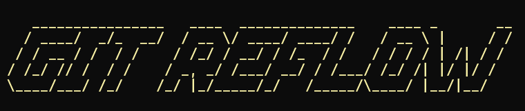

# Reflow

<p align="center">
  
</p>

Release Recovery, Version Conversion, and Docker Release Automation.

Reflow helps automate release workflows by treating Git tags as the source of truth for releases, versioning, and container publishing.

---

## Badges


See: [`docs/badges.md`](docs/badges.md)
for the complete badge reference.

---

## ℹ️ Project Metadata

| Property                     | Value                                         |
| ---------------------------- | --------------------------------------------- |
| Project                      | Reflow                                        |
| Current version              | `v1.0.2`                                      |
| Python package               | `git-reflow`                                  |
| Package compatibility        | Python 3.14+                                  |
| Standard development runtime | Python 3.14                                   |
| CLI framework                | Typer and Rich                                |
| Version strategy             | SemVer tags and PEP 440 package versions      |
| Distribution                 | Source, private GitLab PyPI, Docker, and GHCR |
| Documentation                | Devalltect Docs and repository documentation  |
| License                      | MIT                                           |
| Maintainer                   | Devalltect / Rizky Fernandes                  |

---

## What Is Reflow?

Reflow is a command-line tool designed to simplify release management workflows.

It provides tools for:

- Project initialization
- Version conversion
- Missing-release recovery
- Docker image publishing

Workflow:

```text
Initialize Project
       ↓
Configure Project
       ↓
Convert Tags
       ↓
Recover Releases
       ↓
Publish Containers
```

---

## ✨ Features

- 🏷️ Recovering missing GitHub releases by retriggering tag-based CI/CD
- 🔀 Explicit local or remote tag conversion between SemVer and PEP 440
- 🐳 Building Docker images per tag
- 🦊 Supporting GitHub (GHCR) and GitLab Registry
- ⚙️ Config-driven via `.config/reflow/config.toml`
- 📊 Observable clone, conversion, recovery, initialization, and publish progress

### 🚀 Project Initialization

Bootstrap a project for use with Reflow.

Command:

```bash
reflow init
```

Documentation: [`docs/commands/init/`](docs/commands/init/)

---

### 🔀 Version Conversion

Convert version tags to SemVer by default, or select PEP 440 with
`--to pep440`. Local conversion changes only a persistent checkout; remote
conversion replaces remote refs in one guarded atomic push. Conversion
preserves the original target and supported annotation metadata. Signed tags
and existing destination refs stop the operation before mutation.

Command:

```bash
reflow tags convert local
reflow tags convert remote
```

Documentation: [`docs/commands/tags/convert/`](docs/commands/tags/convert/)

---

### 🛟 Release Recovery

Find existing version tags without corresponding GitHub releases, then delete
and re-push the selected remote tags to retrigger the repository's tag-based
release workflow. This does not create a release through an API, and release
discovery is currently GitHub-only.

Command:

```bash
reflow releases recover
```

Documentation: [`docs/commands/releases/recover/`](docs/commands/releases/recover/)

---

### 🐳 Docker Publishing

Build and publish Docker images from Git tags.

Command:

```bash
reflow dockerize
```

Documentation: [`docs/commands/dockerize/`](docs/commands/dockerize/)

---

## 📦 Installation

Use Python 3.14+ and Git. Docker and provider tools are needed only for the
workflows that use them.

### Install a private GitLab package

Choose a version already published in the target project's registry. In an
activated virtual environment, replace the placeholders:

```text
python -m pip install --index-url "https://gitlab.com/api/v4/projects/<project-id>/packages/pypi/simple" "git-reflow==<package-version>"
reflow --help
```

Use a deploy token with `read_package_registry`. Supply credentials through
[pip authentication](https://pip.pypa.io/en/stable/topics/authentication/),
not committed files or shared command history. The package version is PEP 440:
`v1.0.0-rc.1` becomes `1.0.0rc1`; `v1.0.0` becomes `1.0.0`.
The distribution is named `git-reflow`; the command is `reflow`.
Use `--index-url`, not `--extra-index-url`; review
[GitLab package forwarding](https://docs.gitlab.com/user/packages/pypi_repository/#package-request-forwarding-security-notice)
if dependencies must stay private.

See [installation and registry guidance](docs/user-guide/installation-methods.md) for authentication,
other installation methods, and registry setup.

### Install from source

Clone the repository:

```bash
git clone https://github.com/devalltect00/Git-Reflow.git reflow
```

Enter the project:

```bash
cd reflow
```

For a contributor installation with development, documentation, and
pre-commit tooling:

```bash
make setup
```

The Make workflow uses `venv` by default. Display the activation command with:

```bash
make activate
```

For a manual runtime-only installation, create and activate the environment.

Windows:

```bash
python -m venv venv
venv\Scripts\activate
```

Linux/macOS:

```bash
python3 -m venv venv
source venv/bin/activate
```

Install:

```bash
python -m pip install -e .
```

See [`docs/developer-guide/make-workflows.md`](docs/developer-guide/make-workflows.md)
for local, Docker, Compose, published-image, and dry-run Make targets.

---

## 🚀 Quick Start

Initialize a project:

```bash
reflow init
```

Review `.config/reflow/config.toml`, especially the repository target.
Choose a local `path` or a remote `url`, not both.

Preview only the commands you need:

Convert tags:

```bash
reflow --dry-run tags convert local
reflow --dry-run tags convert local --to pep440
```

Recover missing releases:

```bash
reflow --dry-run releases recover
```

Publish images:

```bash
reflow --dry-run dockerize
```

Dry-run allows read-only discovery and temporary URL-clone setup, but does not
change persistent tags, registry images, or remote state. Diagnostic logs may
still be written. Review the plan before a live run without `--dry-run`.

---

## 📖 Commands

| Command                      | Description                                 |
| ---------------------------- | ------------------------------------------- |
| `reflow init`                | Initialize a project                        |
| `reflow tags convert local`  | Replace converted names in a local checkout |
| `reflow tags convert remote` | Replace converted names on the Git remote   |
| `reflow releases recover`    | Recover missing releases                    |
| `reflow dockerize`           | Build and publish Docker images             |

The former `reflow tags replay` spelling remains as a deprecated compatibility
alias.

### Target Another Repository

Operational workflows can use either an existing local checkout or a remote
GitHub/GitLab URL. For a local checkout:

```bash
reflow --repository ../target-project --dry-run releases recover
reflow -C ../target-project --dry-run tags convert local
reflow -C ../target-project --dry-run tags convert remote
reflow --repo ../target-project --dry-run dockerize
```

Or configure the target once:

```toml
[tool.reflow.repository]
path = "../target-project"
```

If no checkout exists, use a remote URL directly:

```bash
reflow --repository-url https://github.com/acme/project.git --dry-run tags convert remote
reflow --repository-url https://github.com/acme/project.git --dry-run tags convert remote --to pep440
reflow --repository-url https://github.com/acme/project.git --dry-run dockerize
```

Or configure `url` instead of `path`:

```toml
[tool.reflow.repository]
url = "https://github.com/acme/project.git"
```

Reflow clones URL targets into a temporary checkout and removes it when the
command finishes. Configure exactly one of `path` or `url`; an explicit CLI
target overrides configuration. `reflow init` and `tags convert local` require
a persistent checkout. `tags convert remote` accepts a URL and performs one
guarded atomic remote tag replacement. Replace the example URL with your own.
After reviewing the remote conversion preview, remove `--dry-run` and use
`--yes` only when you intend to approve the displayed remote changes.

Progress indicators are enabled by default. For CI logs or redirected output,
disable only the presentation layer without changing execution or dry-run
behavior:

```toml
[tool.reflow.cli.progress]
enabled = false
```

For detailed usage:

[`docs/user-guide/commands.md`](docs/user-guide/commands.md)

---

## 📖 Documentation

### 📘 User Guide [`docs/user-guide/`](docs/user-guide/)

Contains:

```text
getting-started.md
commands.md
lifecycle.md
```

---

### 📘 Initialization [`docs/commands/init/`](docs/commands/init/)

Contains:

```text
overview.md
workflow.md
examples.md
faq.md
```

---

### 📘 Architecture [`docs/architecture/`](docs/architecture/)

Contains:

```text
workflow.md
design-patterns.md
diagrams.md
```

---

### 📘 Configuration [`docs/configuration.md`](docs/configuration.md)

---

### ❓ Questions and Answers [`docs/qa/`](docs/qa/)

Answers common questions about local paths, repository URLs, remote effects,
authentication, and troubleshooting.

---

### 📘 Roadmap [`docs/project/roadmap.md`](docs/project/roadmap.md)

---

### 📘 Future Work

```text
TODO.md
```

---

## 🧱 Architecture

High-level architecture:

```text
CLI
 ↓
Resolver
 ↓
Core
 ↓
Service
 ↓
Executor
 ↓
External Tool
```

Documentation:

[`docs/architecture/workflow.md`](docs/architecture/workflow.md)

---

## ♻️ Recommended Workflow

```text
Install Reflow
      ↓
reflow init
      ↓
Edit config.toml
      ↓
reflow tags convert local
      ↓
reflow releases recover
      ↓
reflow dockerize
```

Run only the commands required for your workflow.

---

## 📍 Roadmap

Current project roadmap: [`docs/project/roadmap.md`](docs/project/roadmap.md)

Future ideas and enhancements:

```text
TODO.md
```

---

## 📁 Project Structure

For the details, see full structure in [`project_structure.md`](docs/project_structure.md).

---

## Repository metadata helper (maintainers)

The optional [metadata sync script](scripts/repository/src/sync_metadata.py)
is source-checkout tooling, not an installed application command. Run it from
this repository's root:

```bash
python scripts/repository/src/sync_metadata.py --dry-run
```

It reads `[project].description` and the separate
`[tool.devalltect.github].topics` / `[tool.devalltect.gitlab].topics` tables
in `pyproject.toml`. Package `keywords` are not repository topics.

Review `GITHUB_REMOTES` and `GITLAB_REMOTES` in the script: the current
defaults are `origin` and `backup`. Each list contains fallback candidates;
the first valid fetch URL selects one repository per provider. Both providers
must resolve. This helper currently targets GitHub.com and GitLab.com.

Dry-run uses Python and read-only Git discovery; it does not call provider
APIs. Live synchronization additionally needs authenticated `gh` and `glab`
with access to update those repositories.

Before removing `--dry-run`, review the targets and metadata carefully:
the live helper does not ask for confirmation, replaces the topic lists, and
clears existing topics when a list is empty or missing. A failure can leave
earlier updates applied; there is no cross-provider rollback.

Known follow-up: the script's docstring still shows the old path, and its
GitHub topic-limit constant is 50 despite
[GitHub's maximum of 20 topics](https://docs.github.com/en/repositories/managing-your-repositorys-settings-and-features/customizing-your-repository/classifying-your-repository-with-topics).
Use the path above and keep the GitHub list within 20 until corrected.
These issues and isolated test coverage are tracked in the
[TODO history](docs/TODO_tracking_history.md).

---

## 🤝 Contributing

Contributions, issues, and suggestions are welcome.

Before contributing, review: [`docs/developer-guide/`](docs/developer-guide/)

and: [`docs/architecture/`](docs/architecture/)

For the details, see [`CONTRIBUTING.md`](CONTRIBUTING.md)

---

## 🔐 Security

See [`SECURITY.md`](SECURITY.md)

---

## 📃 Changelog

`CHANGELOG.md` is prepared during the reviewed release process. For current
development milestones, see the [TODO tracking history](docs/TODO_tracking_history.md).

---

## 📜 License

See [LICENSE](LICENSE) for the licensing terms.

📧 Contact: `devalltect00@gmail.com`

---

_Crafted with ❤️ by Devalltect / Rizky Fernandes_
