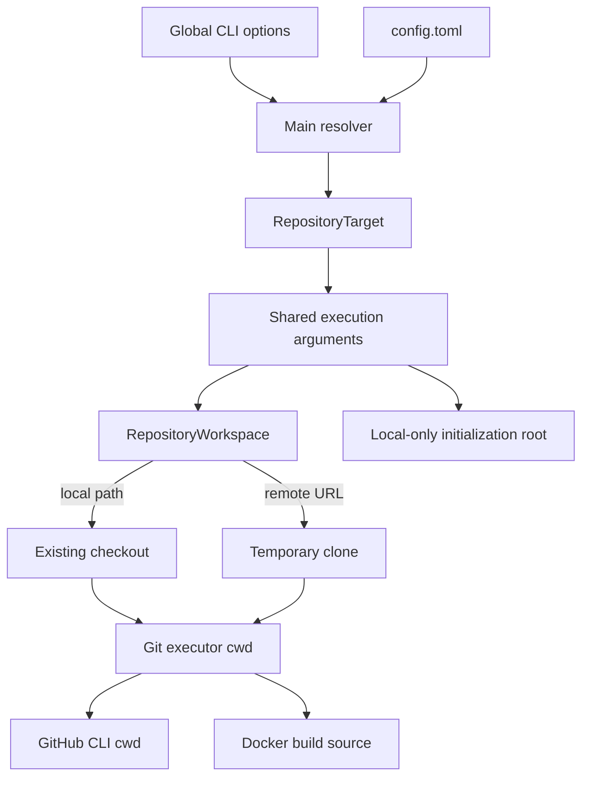

# Repository Targeting

## Purpose

Reflow separates the repository being operated on from the directory where the
CLI process was started. This allows an installed Reflow command, a development
checkout, or a container to operate on another Git repository safely. Targets
may be existing local directories or remote Git URLs that Reflow materializes
as managed temporary clones.

## Resolution Contract

The target repository is resolved once by the global CLI layer using this
priority:

1. `--repository` / `--repo` / `-C`, or `--repository-url`
2. `[tool.reflow.repository].path` or `[tool.reflow.repository].url`
3. The current directory (`.`)

Path and URL values are mutually exclusive at each priority level. An explicit
CLI target replaces the configured target instead of being combined with it.

Relative paths are resolved from the directory where Reflow was invoked. A
resolved local path must exist and must be a directory. A URL must be a valid
HTTPS, HTTP, SSH, Git-protocol, or SCP-style Git URL and must not contain
embedded HTTPS credentials. Commands that require Git perform their own
Git-repository validation after materialization.



## Managed Workspace Lifecycle

A local target yields its validated path without copying it. A remote target
uses a command-specific temporary checkout:

```text
validate URL
    ↓
create temporary directory
    ↓
git clone URL checkout
    ↓
run the requested workflow against checkout
    ↓
remove the temporary directory on success or failure
```

Cloning still occurs during `--dry-run` because tag and release discovery need
real repository data. Dry-run continues to suppress tag creation, remote tag
mutation, and image publication. The clone itself is ephemeral local state,
not a mutation of the source repository.

`reflow init` accepts only a local target. Initialization against a temporary
clone would create files that disappear during cleanup and would not commit or
push them, so URL mode is rejected with a remediation message.

## Configuration Ownership

The configuration file is still loaded from:

```text
.config/reflow/config.toml
```

under the invocation directory. It may select either a local checkout or a
remote repository URL.

```toml
[tool.reflow.repository]
path = "D:/projects/testing_reflow"

[tool.reflow.git]
default_remote = "origin"
```

Or, instead of `path`:

```toml
[tool.reflow.repository]
url = "https://github.com/example/testing_reflow.git"
```

The Docker image setting is deliberately independent:

```toml
[tool.reflow.github]
image = "ghcr.io/example/testing_reflow"
```

`repository.path` selects source code and Git metadata. `github.image` and
`gitlab.image` select container-registry destinations.

## Command Effects

| Command | Local target | Remote effect |
| --- | --- | --- |
| `reflow init` | Creates initialization files under a local target root; URL targets are rejected | None |
| `reflow tags convert local` | Atomically replaces local tag names | None |
| `reflow tags convert remote` | Leaves local tag refs unchanged | Atomically creates destination remote refs and deletes source remote refs |
| `reflow releases recover` | Reads target tags and release state | Re-pushes selected tags whose GitHub release is missing |
| `reflow dockerize` | Builds tagged target snapshots | Pushes images to configured registries |

All commands must display their resolved repository before execution. Remote
or registry mutations remain explicit and support dry-run previews.

## Authentication and URL Safety

Reflow does not store tokens in `config.toml` and does not add credentials to a
clone URL. Git, SSH, GitHub CLI, and Docker continue to use their normal
credential stores. HTTPS URLs containing user information or tokens are
rejected so command logging cannot expose credentials.

The URL identifies the Git repository only. It does not replace
`github.image`, `gitlab.image`, or Docker registry authentication.

## Release Recovery Naming

The canonical command is:

```text
reflow releases recover
```

It means: recover missing GitHub releases by deleting and re-pushing their
existing remote tags so tag-triggered release automation runs again.

The former `reflow tags replay` command remains as a deprecated compatibility
alias during migration.

## Docker Tag Snapshots

Each versioned image must be built from the source represented by that Git tag,
not repeatedly from the target repository's current checkout. Reflow creates a
temporary detached Git worktree for each tag, supplies that path as the Docker
build context, and removes the worktree afterward.

## Dependency Direction

```text
CLI option/configuration
        ↓
RepositoryTarget
        ↓
Execution arguments
        ↓
RepositoryWorkspace
        ↓
Materialized local path
        ↓
Factories
        ↓
Git / GitHub / Docker executors
```

The repository clone executor owns only `git clone`. Existing Git, GitHub, and
Docker executors continue receiving a concrete local path and do not read Typer
state or configuration directly. This keeps target selection testable,
prevents current-working-directory leakage, and avoids duplicating remote-mode
logic across services.

## Trade-offs

- Temporary clones provide isolation and require no persistent local checkout,
  but repeat network transfer for each command.
- Existing local paths remain faster and can use intentional uncommitted work,
  but their state is controlled by the user.
- A future cache strategy can be added behind `RepositoryWorkspace` without
  changing command or executor interfaces.
