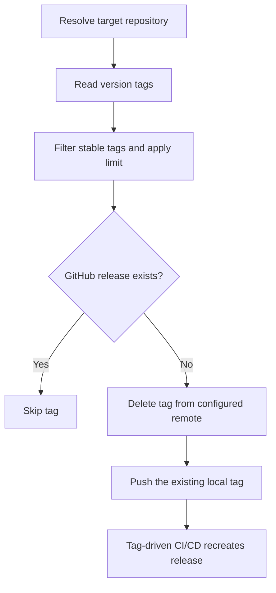

# Release Recovery Workflow

## Data Flow

Repository resolution follows one priority for every workflow:

1. Global `--repository`, `--repo`, `-C`, or `--repository-url` option.
2. `[tool.reflow.repository].path` or `[tool.reflow.repository].url` in Reflow
   configuration.
3. The invocation directory.

URL targets are temporarily cloned before Git and GitHub CLI commands run. The
Reflow source checkout is not implicitly used as the target.

## Compatibility Alias

`reflow tags replay` delegates to the same implementation and prints a
deprecation warning. Existing scripts continue to work, but new scripts and
documentation should use `reflow releases recover`. The deprecation is visible
both in CLI help and when the alias is executed.
