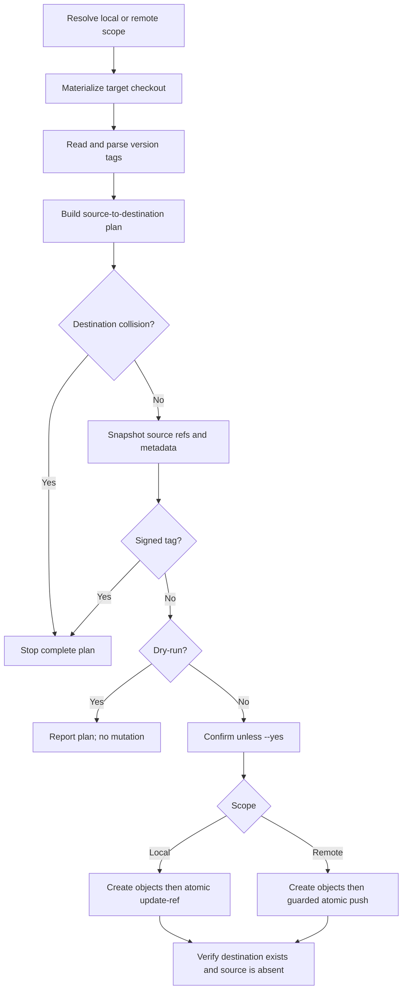

# Tag conversion workflow

Planning and metadata inspection are read-only. For annotated tags, destination
objects are created only after confirmation. Object creation does not change a
ref; the visible replacement occurs at the atomic local or remote boundary.

Local replacement uses Git's reference transaction protocol. Remote
replacement sends destination creations and source deletions in one
`git push --atomic` operation with expected source object IDs. If the remote
does not support atomic pushes or its state changed, the complete update is
rejected rather than falling back to partial changes.
